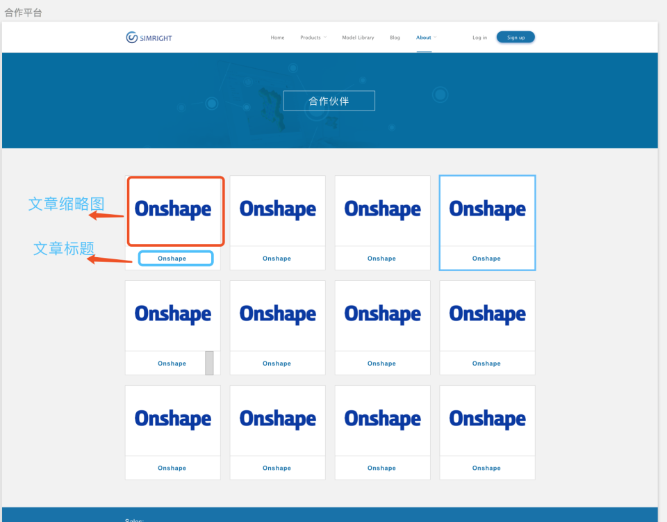
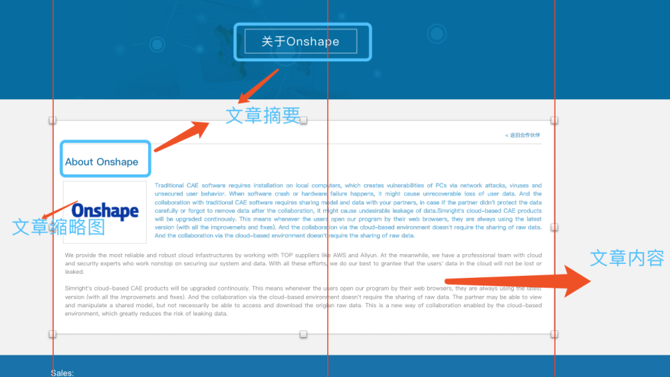
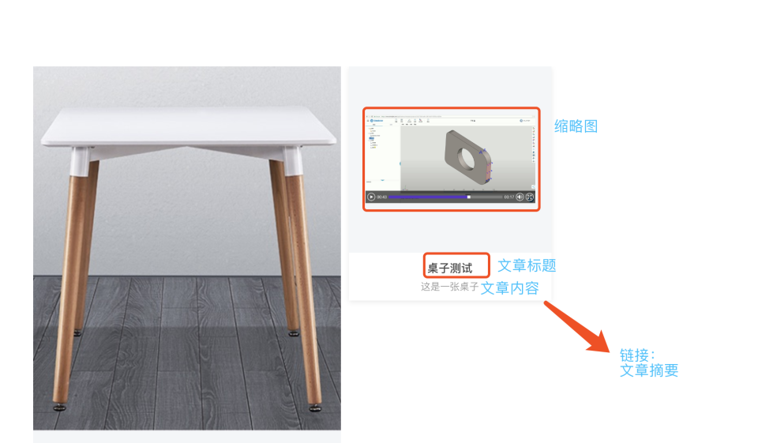

# simright-wordpress themes 后台使用规范

## 一、分类目录
```
|--视频
|   |--类型
|   |   |--产品简介
|   |   |--产品功能
|   |   |--前处理
|   |   |--求解
|   |   |--后处理
|   |
|   |--产品
|   |   |--Simulator
|   |   |--Toptimizer
|   |   |--WebMesher
|   |   |--Viewer
|
|--博客
|   |--结构力学
|
|--新闻
|
|--加入我们
|
|--功能点
|
|--合作伙伴
|
|--用户故事
|
|--直播（live）
|	|--即将进行的直播（upcoming-live）
|	|
|	|--已经结束的直播（completed-live）
|
|--家具page
|   |--桌子
|   |--椅子
|
|--解决方案（press-solutions）
|   |
|   |--(解决方案-结构分析)press-structural-analysis
|   |--(解决方案-拓扑优化)press-topology-optimization
|   |--(解决方案-前处理)press-pre-processor
|   |--(解决方案-格式转化)press-converter
|   |--(解决方案-在线协作)press-online-collaboration
|   |--(解决方案-3D打印)press-3d-printing
|
|--pdm详情页(pdm)
|   |
|   |--团队协作(team-collaboration)
|   |--版本管理(version-management)
|   |--模型对比(model-contrast)
|   |--在线查看(online-view)
|   |--计算结果查询(calculation-results-query)
|   |--免安装(free-installation)

## 二、视频
> 所有视频必须添加`缩略图`
### 2.1 前处理、求解、后处理
> 视频数量需`大于等于4个`。（结构专题轮播至少需要4篇文章）
### 2.1 产品:Simulator,Toptimizer,WebMesher,Viewer
> 文章需含有`摘要`。(网站overview页面获取文章标题，摘要，缩略图)
## 三、博客
> 博客名称必须含有英文状态下的冒号`:`。（不要问我为什么，设计是这样设计的。把标题按分号分成两行）
>
> 博客必须写`摘要`。（博客列表获取的是博客摘要）
## 四、新闻
> 新闻必须写`摘要`。（新闻列表获取的是新闻摘要）
## 五、功能点
> 列尽量不要太多，插入的图片大小为15*15就好了。（否则小屏就没法看了）
## 六、合作伙伴
> 文章标题为合作伙伴的名称
>
> 文章缩略图为合作伙伴商标
>
> 文章摘要为合作伙伴介绍标题





## 七、用户故事

图片比例必须1:1

## 八、直播

1. 文章分类选择“直播”+“即将进行的直播”或”直播“+”已经结束的直播“

**分类目录说明**

```markdown
|--直播（live）
|	|--即将进行的直播（upcoming-live）
|	|
|	|--已经结束的直播（completed-live）

```


**字段说明**

```
time:直播时间
live-language：语言
applicable-people：直播适用对象
number：已报名人数
person-name：直播人名字
person-title:直播人头衔
person-avatar：直播人头像
person-info：直播人信息（换行使用 </br>）
video-link：已经结束的直播视频链接
living-link: 直播中（链接）
```


## 七、家具专题

家具分类下的文章用于家具专题。使用page furniture模板，无父级
>
> 缩略图必填
>
> 桌子文章写在桌子分类下
>
> 椅子文章写在椅子分类下



## 八、解决方案

自定义标签：solution-tag

自定义链接：solutions-link

## 九、pdm详情页
自定义视频及链接：pdm-video --- 用于轮播视频链接（图片为视频截图，链接为视频播放链接）

例子：
```json
[{"img":"https://oss.simright.com/imng.png","link":"https://www.simright.com1"},{"img":"https://oss.simright.com/imng.png","link":"https://www.simright.com2"},{"img":"https://oss.simright.com/imng.png","link":"https://www.simright.com3"}]
```

详情页中，

上方标题为 `文章标题`

标题下方描述为 `摘要`

左侧轮播为上方`自定义字段`

下方简介为`文章正文` 


